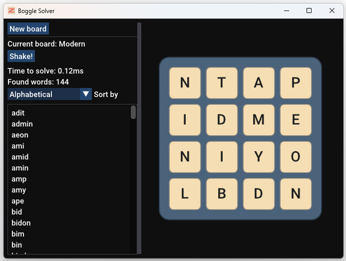

# BoggleSolver

A Boggle solving engine, plus a small desktop app for playing with it: given a grid of letter dice, it finds every valid word that can be traced through adjacent tiles.

  

## Algorithm

At its core, the solver runs a depth-first search from every tile on the board. From each starting tile, it walks to the (up to) 8 neighbouring tiles, extending the current letter sequence one character at a time and backtracking once a branch is exhausted. Any sequence that matches a dictionary word is captured, along with the path(s) that spell it.

## Optimisations

- **Multi-threaded** - each tile seeds an independent search that runs on its own worker thread, since the 8 DFS trees don't share any mutable state while searching. Results are merged back on a single thread once each seed completes.
- **Pruning** - before recursing into a neighbour, the search checks whether *any* dictionary word begins with the sequence so far. If not, that whole branch is abandoned immediately instead of continuing to dead ends.
- **Dictionary optimisation** - words are stored sorted and packed into a single contiguous buffer (no per-word allocations), searched via binary search. The dictionary is also split into sub-lists keyed by each word's first three letters, so a lookup only needs to binary search the matching sub-list rather than the whole dictionary. 'qu' is also collapsed to a single stored letter, matching the fact that a real Boggle die never shows a bare 'q'.
